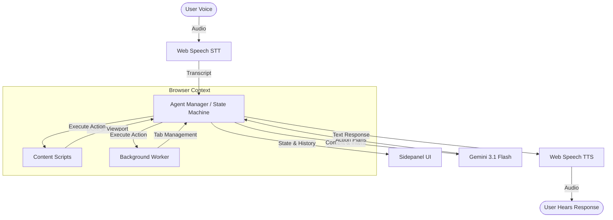

<div align="center">
  
  <h1>Lucy</h1>
  <p><b>Voice-first Browser Assistant</b></p>
  <p>An AI-powered browser assistant that helps users navigate the web using natural voice interaction.</p>
  
  <br />
  <a href="https://lucyx.vercel.app/">
    
  </a>
  <br />
</div>

## Overview

Lucy enables users to browse websites using natural voice conversations. 

Instead of relying on traditional screen readers, the assistant understands page context, reasons about user intent, and performs actions directly in the browser.

---

## Why I Built This

Traditional accessibility tools focus on reading content.

I wanted to explore whether an AI agent could understand webpages, maintain conversational context, and actively assist users instead of simply narrating interfaces.


## Features

- Natural voice interaction
- Native browser speech recognition & synthesis
- Autonomous browser automation (click, type, scroll, navigate)
- Vision-enabled DOM understanding
- Multi-step task execution
- Context-aware intent classification
- Apple-inspired glassmorphism UI

---

## Architecture



Lucy is built around a deterministic state machine that manages the flow between listening, thinking, planning, and executing. 

When you speak, the native **Web Speech API** captures the audio and sends the transcript to the **Agent Manager**. The agent pulls the current page's context—using a lightweight "Set of Marks" DOM extraction in the **Content Script**—and passes it to **Gemini**. Gemini classifies your intent and streams back a step-by-step plan. The Agent Manager executes those actions directly on the DOM and reads out the final response using native browser **TTS**.

---

## Tech Stack

| Layer | Technology |
| --- | --- |
| Extension | Chrome/Edge API, Manifest V3 |
| Frontend | Vanilla TypeScript, CSS Glassmorphism |
| AI | Gemini (3.1-flash-lite / 3.0-pro) |
| Speech | Web Speech API (STT & TTS) |
| Build | Vite, TypeScript |

---

## Getting Started

```bash
git clone https://github.com/imshreyaskn/lucy.git

cd lucy/voice-agent-extension

npm install

npm run build
```

Then load the `dist` directory in your browser via `chrome://extensions` or `edge://extensions` (Developer Mode > Load Unpacked).

---

## Project Structure

```text
src/
├── background/
├── content/
├── lib/
├── options/
├── sidepanel/
└── public/
```

---

## Roadmap

- [x] Voice Interaction
- [x] Browser Automation
- [x] Context Memory
- [x] Vision Capabilities
- [ ] Multi-Agent Collaboration
- [ ] Offline Mode

---

## Lessons Learned

Building this project taught me the importance of:

- Agent orchestration
- Deterministic state machines
- Latency optimization
- Prompt engineering for DOM interactions
- User-centric accessibility

---

## Future Work

- Add autonomous multi-step planning
- Support Firefox / Safari
- Persistent cross-session memory
- Local LLM fallback

---

## License

MIT
